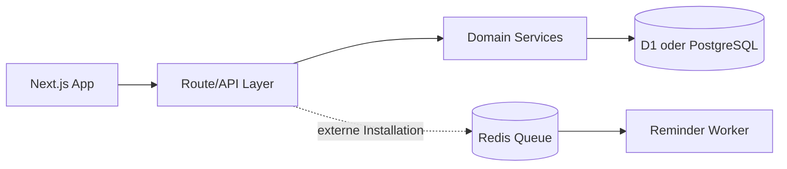

# HausHalt

Schweizer Alltagsbudget- und Rechnungs-Tracker für Familien, Paare und WGs. HausHalt verwaltet gemeinsame Haushalte, wiederkehrende Rechnungen, Budgets und centgenaue Kostenaufteilungen.

## Funktionsumfang

- Mandantenfähige Haushalte mit Owner-, Admin- und Member-Rollen
- Einmalige und wiederkehrende Rechnungen
- Gleichmässige, prozentuale, feste und anteilige Splits
- CHF und Schweizer Kategorien wie Serafe, Krankenkasse, Säule 3a und Steuerrücklagen
- Dashboard, Fälligkeitsstatus und Monatsbudget
- PostgreSQL-/Prisma-Datenmodell mit Soft Deletes und Audit-Grundlage
- Rechnungen erstellen, suchen, filtern, bezahlen und löschen
- Monatsbudget und Einkommen bearbeiten
- Haushaltsmitglieder hinzufügen und als Split-Teilnehmer auswählen
- Automatischer Überfälligkeitsstatus und Audit Trail
- Responsive Next.js-Oberfläche, REST API, Unit Tests, Docker und CI

## Architektur

HausHalt ist ein modularer Monolith. Die Web-Oberfläche und HTTP-Routen laufen in Next.js; Geschäftsregeln liegen in unabhängigen TypeScript-Modulen. Die veröffentlichte ChatGPT-Sites-Version verwendet Cloudflare D1 über Drizzle. Für eine unabhängige SaaS-Installation enthält das Repository zusätzlich ein vollständiges Prisma/PostgreSQL-Datenmodell. Redis ist für externe Reminder-Worker vorgesehen.



## Datenmodell

Die Mandantengrenze ist `Household`. Mitgliedschaften verbinden Benutzer und Haushalte. Eine `Expense` gehört zu genau einem Haushalt und besitzt beliebig viele `ExpenseSplit`-Einträge. In D1 werden Beträge als ganzzahlige Rappen gespeichert; PostgreSQL verwendet `Decimal(14,2)`. Damit entstehen keine Gleitkommafehler.

Wichtige Dateien:

- `db/schema.ts` und `drizzle/`: produktive D1-Struktur und Migration
- `prisma/schema.prisma`: PostgreSQL-SaaS-Modell
- `lib/data.ts`: mandantensichere Datenzugriffe und Geschäftsabläufe
- `lib/splits.ts`: deterministische, centgenaue Aufteilung
- `app/api/`: Dashboard-, Rechnungs-, Mitglieder- und Health-Endpunkte

## Lokal starten

Voraussetzungen: Node.js 22+, Docker und Docker Compose.

```bash
npm ci
npm run dev
```

## Qualität prüfen

```bash
npm run db:validate
npm run test:unit
npm run lint
npm run build
```

## Roadmap

- Einladungs-E-Mails und Annahme-Workflow
- BullMQ-Worker für E-Mail-Fälligkeitserinnerungen bei externer Installation
- Beleg-Upload auf S3-kompatiblen Speicher
- Schweizer QR-Rechnungsimport nach SIX-Standard
- Datenexport, Löschworkflow und SaaS-Abonnements

## Sicherheit

Das Datenmodell ist auf strikte Haushaltstrennung ausgelegt. Die Sites-Version nutzt die vom Hosting weitergereichte authentifizierte Identität; Datenzugriffe ermitteln den Haushalt serverseitig und vertrauen keiner vom Client gelieferten Mandanten-ID. Audit Logs, Eingabevalidierung und minimale Datenerhebung sind eingebaut. Für eine externe Produktion sind zusätzlich Rate Limiting, sichere Sessions, E-Mail-Verifikation und ein sauber geregelter Hosting-Standort erforderlich.

## Lizenz

Copyright © 2026 Ari Sajjadi. All rights reserved.
